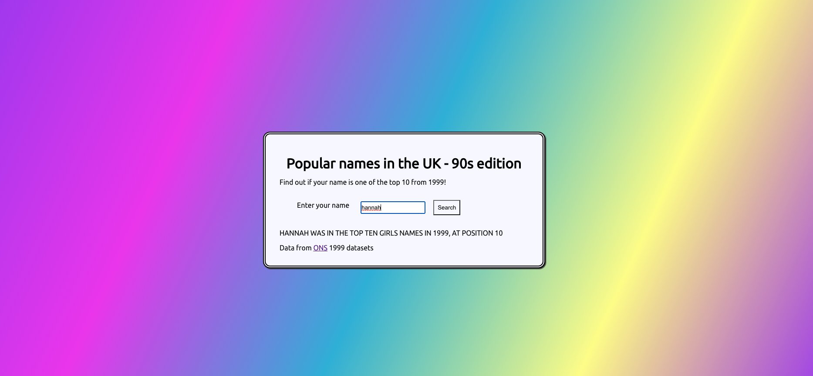

# Basic Typescript Name Finder

A very basic app I built to learn more about Typescript in React 🚀

You can search your name and find out if it appeared in the top ten baby names in 1999 in the UK (very niche, I know) 👶

## Available Scripts

In the project directory, you can run:

### `npm start`

Runs the app in the development mode.\
Open [http://localhost:3000](http://localhost:3000) to view it in the browser.

## Preview

